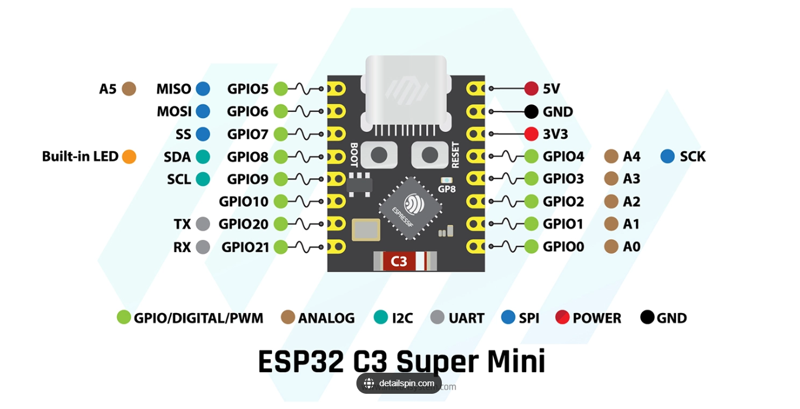

# Project Overview
Controlling a 3rd party IR remote controlled LED through the Phillips-Hue lighting system

Demos:
- [On/Off control demo](https://www.youtube.com/shorts/3DD_msGkm7w?feature=share)
- [Color control demo](https://www.youtube.com/shorts/cillKHZvEkQ?feature=share)

Hardware Needeed:
- [ESP8266 Microcrontroller](https://www.amazon.com/HiLetgo-Internet-Development-Wireless-Micropython/dp/B081CSJV2V/ref=sr_1_3?crid=2FN80O4DEJ35Q&dib=eyJ2IjoiMSJ9.4xEr54v6vHUSws_RbogXUUQ0-qx0V7rAto5k-V99Mo0B0nICbDVzAQhl7oN_vez6h6I_iQWVLfWSQE1FCVuprA5YJ1QEEvuTtAwUl-Pv1QlIUN76l8YZnHXtN_q3rcoP7MQUSQHvrSm5hWsLkkhQXWyyjSHtN6FbixxEHky-_DTnwwE4OpbVHigxTFzypAsI_txCKg245Xo4zAAZbrvLMWYMtuxcqqW9dJRCkVbgO3s.iHiyCP1_ftZqlOarHK6rW__RVd4USzGyAUK-tuX9USc&dib_tag=se&keywords=esp8266&qid=1708795372&sprefix=esp826%2Caps%2C241&sr=8-3)
- [Arduino Compatible IR Transmitter](https://www.amazon.com/Digital-Receiver-Transmitter-Electronic-Building/dp/B08X2MFS6S/ref=sr_1_3?crid=LV2HYJJ67B2B&dib=eyJ2IjoiMSJ9._vf72KYZ3KT9icycUs9mdM0CsoL-vlhHUhWBduX01chbdRf9ogw1yb3ScaPJKxriGIoUuo9_0lG49d2js_uIMINOJ3cXmQ7Jv-eysLc-SBEYQwJJ2mn_LoATZjl5XkzK-37B2MUVydVT8sQhzrY_6B4ak7v9PqmwDMIVparTQFXOoewNgNVv1AIhPWM5GN-xfqfgi74LaiLus1CnnDIEduFiifhG1LYH8rDXCy72Bg8.Eq7Ml8uMY73ev3FV3fXqfBEB8Ew0eEBwu8JQwosaKzA&dib_tag=se&keywords=ir+transmitter+arduino&qid=1708795775&sprefix=ir+transmitter+arduin+o%2Caps%2C187&sr=8-3)

Concept of operations:
1. The ESP8266 is used to connect to Philips-Hue's existing lighting API.
   1. The ESP8266 uses the HTTPS connection to establish the 'eventstream' endpoint. Any lighting changes are updated through this event stream
2. The event stream is parsed for changes to a specific light 
   1. This will need to be an existing smart light in the hue system; The IR remote controlled LED is synchronized with this light in the hue system.
3. Changes like on/off state and color are then converted to their corresponding IR command and sent through the IR transmitter module.

This project is working with this [Levitating Moon Lamp](https://www.amazon.com/VGAzer-Levitating-Floating-Spinning-Printing/dp/B07CR2JYPH/ref=sr_1_7?crid=3GX85ZF9NJFY5&dib=eyJ2IjoiMSJ9.Xn7z8MvuMuKHdWTVc01bqDk6qeGk6q3t2jc2lKmJgvNPJDdJbwNo5Wd_wTgc0rj-eTg7f8K0xyGAuzkzToHNE6rdS4E5WU8yvd1s4K2fPcjvmEJowMOmqKtgY8wjbjjUaCRZgjgu05ICUPWctfe8N9gs2oKWsY--IUp4kIQdsvirCf36yZ7B7CdCKoaiIm90TvYdw7rTX1grbETf3302U3O-K-C_dYDdHkDh5p_qTTIRexIgwcxvOUetipo6wAFYn4rVa0yH6CbapVVR0KCfPrbdxRIEGH8BHqnJUz-nSOY.R6E22jOTyq1MgoRUMVWY0s4bHgMr_b9oUrgh_gqicnc&dib_tag=se&keywords=levitating+moon+lamp&qid=1708794988&sprefix=levitating+m%2Caps%2C179&sr=8-7). Many other IR controlled LEDs use similar control schemes so controlling them is just a matter of figuring out the specific IR protocol and command patterns.


# Hardware
*In the future I want to use smalle components for a better form factor.*
- [ESP8266 NodeMCU CP2102 ESP-12E](https://www.amazon.com/HiLetgo-Internet-Development-Wireless-Micropython/dp/B081CSJV2V/ref=sr_1_3?crid=3RY5L1PWV5FGI&dib=eyJ2IjoiMSJ9.gJShu3rQeKD8EK_mYUdf6cd4BpJCiIA6K-ygA0Pvs5nZCA8Fda1XucdQ68P8_r_yCtdOFaBMpkvhYCfFKoqqf6l1l83HW92eW5BHEfuQVcX6ao_6qMOjelS0dLL4Fv8mFD1CoPZfnWPy1sVTvfUxuP577Omi-V0C2BWmJklYvZhQcE_zBLhQ_V38iVCE4ElQM2pQ-J61loRnFOb-RhFFrhNDoz9O-WTVWdAj4Zbr25M.a6ClmRteiC9xIb58TLIvnpTA2p6NXxhyJ9eUxw0oe9k&dib_tag=se&keywords=hiletgo+esp8266&qid=1708305050&sprefix=hiletgo+esp8266%2Caps%2C146&sr=8-3)
- [IR Transmitter](https://www.amazon.com/Digital-Receiver-Transmitter-Electronic-Building/dp/B08X2MFS6S?crid=1VFT7EF43LX16&dib=eyJ2IjoiMSJ9.78xUnPiotr3tb4AOjOm73Yf0rOOLn3XVsqikcNM-7k_Kw7wqTGZyH9m6oQZMjDtdglRPPkg4k6lyspNhNpSORGpahDMilLvMg-mLkY_itpQtHdfjZVxqa7CRUH6bBF3xSn9VbdKDYSyQsd-RgdtA5upYQlH18zG3V0gS85cr-KJAljVqFTwRBEk46BcbgTikg42-UsC37illNYyNSD-4Y5BCxCaaepT4S6Ac4mL5dQQ.illMC6Zoy0JQWVAUDdRTf6CX_Xpm6YyAIOBJ7CVD590&dib_tag=se&keywords=ir%2Btransmitter&qid=1762888183&sprefix=ir%2Btransmitte%2Caps%2C158&sr=8-3&th=1)
- [12v to 5v buck converter (optional)](https://www.amazon.com/Converter-DROK-Regulator-Inverter-Transformer/dp/B01NALDSJ0?crid=3BLXR9TPX9DUD&dib=eyJ2IjoiMSJ9.S_BVhK2dvgzSxopqY7mkyE6R6S8Rjmdj-aUPxL9FGb-RAnsgr3fjrYEp9iC-ROJv5tsJOsQDKJ3XskRMOYbNk7csmfNZ8l58q8Pa2-1_ew9BNrQ4CY2nVXzIyn0-yRGOc5iINP5adgGsUKPsfcUp-d_NakumgihARi9cQIptr8HT0bN5FwcgpwARhfS8JuxBzQ35WQIuOBCaN9nVamrXYABL3iyRVQShwt1yekTzDRk.GzaYyQwM6VD-hJ3sT-bJOzn8Kjwu7pdoVasHYDddqXc&dib_tag=se&keywords=12v%2Bto%2B5v%2Bbuck%2Bconverter&qid=1762888205&sprefix=12v%2Bto%2B5v%2Bbuck%2Bconvert%2Caps%2C191&sr=8-3&th=1)

# Setup


**Flashing the microcontroller**
- Open the `hue_ir_lightsync.ino` in arduino
- Configure the `arduino_secrest.h` file from the `TEMPLATEarduino_secrest.h` file
  - Need HUE application key. This requires signing up for the HUE developers program (free): https://developers.meethue.com/develop/get-started-2/.
- Install libraries:
  - ArduinoJson
  - Add the latest stable release of the ESP866 libraries to Arduino's "Additional Board Manager URLs". ```http://arduino.esp8266.com/stable/package_esp8266com_index.json```.
- Flash the `hue_ir_lightsync.ino` program to the microcontroller

# Attempting to use other microcontrollers for this
ESP32-C3 Super Mini

Not sure which pin will work for this.

